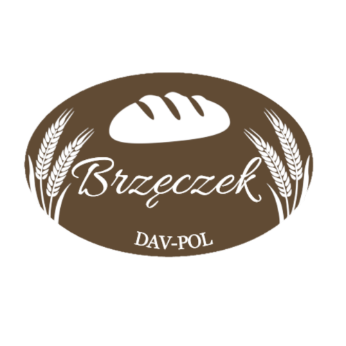

<!-- PROJECT LOGO -->
<br />
<div align="center">
  <a href="https://github.com/navid9696/bakeryDAV-POL/tree/main/src/img/logo.png">
    
  </a>

  <h3 align="center">F.P.H.U. DAV-POL Bakery Website</h3>

  <p align="center">
    <br />
    <a href="https://www.piekarniabrzeczek.pl/">View site</a>
  
  </p>
</div>


<!-- ABOUT THE PROJECT -->
## About The Project

[![Product Name Screen Shot][product-screenshot]](https://www.piekarniabrzeczek.pl)

Welcome to the GitHub repository for the F.P.H.U. DAV-POL Bakery website. This is a single-page website providing information about the bakery and serving as a digital business card. Users can learn various details about the company, including its location on Google Maps, contact information such as phone and email, a link to the Facebook page, and a functional contact form powered by emailJS. The website also utilizes real cookies (not local storage) for certain functionalities.

<p align="right">(<a href="#readme-top">back to top</a>)</p>


### Built With


* [![HTML][HTML5]]
* [![Kit][Kit]][https://codekitapp.com/help/kit/]
* [![SCSS][SCSS]][https://sass-lang.com]
* [![JavaScript][JavaScript]]
* [![Gulp][Gulp]][https://gulpjs.com]

<p align="right">(<a href="#readme-top">back to top</a>)</p>


<!-- GETTING STARTED -->
## Getting Started

This is an example of how you may give instructions on setting up your project locally.
To get a local copy up and running follow these simple example steps.

### Prerequisites

This is an example of how to list things you need to use the software and how to install them.
* npm
  ```sh
  npm install
  ```

### Installation

_Below is an example of how you can instruct your audience on installing and setting up your app. This template doesn't rely on any external dependencies or services._


1. Clone the repo
   ```sh
   git clone https://github.com/navid9696/bakeryDAV-POL.git
   ```
2. Install NPM packages
   ```sh
   npm install
   ```
3. Run Gulp
   ```sh
   gulp
   ```

<p align="right">(<a href="#readme-top">back to top</a>)</p>


<!-- LICENSE -->
## License

Distributed under the MIT License. See `LICENSE.txt` for more information.

<p align="right">(<a href="#readme-top">back to top</a>)</p>


<!-- CONTACT -->
## Contact

Dawid Brzęczek - dawidbrzeczek18@gmail.com

Project Link: [https://github.com/navid9696/bakeryDAV-POL](https://github.com/navid9696/bakeryDAV-POL)

<p align="right">(<a href="#readme-top">back to top</a>)</p>


